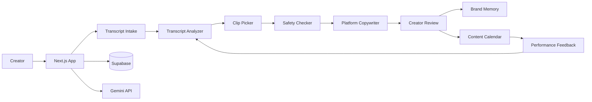

# Architecture

```mermaid
flowchart LR
  Creator --> Web[Next.js App]
  Web --> Intake[Transcript Intake]
  Intake --> Analyzer[Transcript Analyzer]
  Analyzer --> Picker[Clip Picker]
  Picker --> Safety[Safety Checker]
  Safety --> Writer[Platform Copywriter]
  Writer --> Review[Creator Review]
  Review --> Memory[Brand Memory]
  Review --> Calendar[Content Calendar]
  Calendar --> Feedback[Performance Feedback]
  Feedback --> Analyzer
  Web --> DB[(Supabase)]
  Web --> LLM[Gemini API]
```

